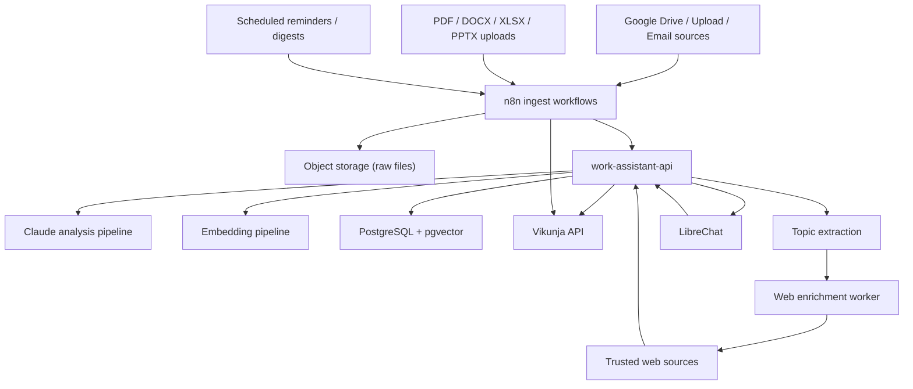

# Work Assistant Architecture

## Goal

Zbudowac serwerowego asystenta pracy, ktory:

- analizuje kazdy email i dokument przez Claude,
- analizuje prezentacje, PDF-y, Wordy i Excele,
- przechowuje baze wiedzy na serwerze,
- rozszerza wiedze przez kontrolowany research internetowy,
- odpowiada na pytania z cytatami do zrodel,
- wyciaga zadania, deadline'y i follow-upy,
- synchronizuje zadania i przypomnienia z osobnym systemem taskowym,
- daje jeden interfejs do rozmowy i wykonywania akcji.

## What We Keep vs Replace

### Keep

- `n8n` jako orkiestracja i automatyzacje
- `LibreChat` jako obecny chat UI na start
- `Vikunja` jako system taskow / deadline'ow / list

### Add

- osobny serwis `work-assistant-api` jako warstwa wiedzy i narzedzi dla AI
- osobna baza `PostgreSQL + pgvector` pod knowledge base
- object storage na surowe pliki i przetworzone artefakty
- kolejka / worker do backfillu i reprocessingu
- worker `web-enrichment`, ktory buduje szerszy kontekst z internetu na bazie tematow z maili i dokumentow

### Do Not Use As Core Knowledge Layer

- samo `n8n` jako knowledge base
- samo `LibreChat RAG` jako jedyne zrodlo prawdy
- sam `Vikunja` jako magazyn wiedzy

## Recommended Stack

### UI

- Start: `LibreChat`
- Alternative if needed later: `Open WebUI`

### Orchestration

- `n8n` do triggerow, webhookow, harmonogramow, przypomnien i prostych integracji

### Knowledge Layer

- `FastAPI` lub `NestJS` jako `work-assistant-api`
- `PostgreSQL + pgvector` jako glowna baza wiedzy
- `S3-compatible storage` na raw files, preview i eksporty

### LLM Layer

- `Claude` do analizy, klasyfikacji, ekstrakcji zadan i odpowiedzi
- embeddings jako osobna decyzja architektoniczna:
  - `Anthropic Embeddings` jesli chcesz jeden vendor,
  - albo osobny provider embeddingow, jesli wyjdzie lepszy koszt / jakosc / latency

### Task Layer

- `Vikunja` jako system-of-record dla taskow i deadline'ow
- mirror task metadata do Postgresa, zeby AI widzialo wszystko w jednym miejscu

## System Diagram

## Data Model

### Core Tables

- `sources`
  - source type, external id, checksum, status
- `documents`
  - title, source, mime type, raw file path, extracted text, language, created_at
- `document_chunks`
  - document id, chunk index, text, embedding, token_count
- `document_analysis`
  - document id, model, prompt version, summary, category, priority, confidence, entities, deadlines
- `knowledge_topics`
  - canonical topics emerging from mail, docs and web research
- `document_topics`
  - relation between documents and topics with confidence and origin
- `enrichment_jobs`
  - pending/running/completed internet research jobs triggered by topics
- `tasks`
  - external task id, source document id, title, description, due date, priority, status, assignee
- `entities`
  - people, companies, projects, contracts, topics
- `document_entity_links`
  - relation between docs and entities
- `reminders`
  - task id, remind_at, channel, status

### Required Properties Per Document

- raw file
- extracted text
- Claude summary
- Claude structured extraction
- chunk embeddings
- source metadata
- topic links
- provenance / source URL
- reprocessing version

## Processing Pipeline

### Historical Backfill

1. List all files from Google Drive / source folder.
2. Save raw file to object storage.
3. Extract text from `.msg`, `.eml`, `pdf`, `docx`, `xlsx`, `pptx`.
4. Call Claude with a strict JSON schema:
   - summary
   - action items
   - deadlines
   - participants
   - organizations
   - topics
   - urgency
   - category
   - open questions
5. Create / update canonical topics from extracted entities and themes.
6. Schedule optional web enrichment jobs for the strongest topics.
7. Chunk the normalized text.
8. Create embeddings for chunks.
9. Save everything to `PostgreSQL + pgvector`.
10. Create or update tasks in Vikunja.
11. Mark document as processed with model version.

### Ongoing Ingest

1. Trigger on new source file.
2. Deduplicate by external id + checksum.
3. Run the same analysis pipeline.
4. If document changes, create a new analysis version and refresh embeddings.
5. If document introduces a strategic topic, queue web enrichment.

### Web Enrichment

1. Worker takes high-signal topics from `knowledge_topics`.
2. Builds controlled web queries against trusted or allowed sources.
3. Fetches web pages, papers, reports or market updates.
4. Normalizes the content into new `documents` with source type `web_research`.
5. Runs the same analysis/chunking/embedding pipeline.
6. Links results back to the originating topic and source document.

## Query Pipeline

### Q&A

1. User asks in chat.
2. `work-assistant-api` classifies intent:
   - knowledge query
   - task query
   - action request
   - reminder request
3. Retrieve:
   - semantic chunks from pgvector
   - structured entities and deadlines
   - enriched web context linked to the same topics
   - relevant tasks from Vikunja mirror
4. Claude answers with citations to source documents.

### Actions

For commands like:

- "co mam do piatku"
- "oznacz to zadanie jako zrobione"
- "przypomnij mi jutro o umowie"
- "znajdz wszystkie maile od firmy X"
- "co nowego w temacie X poza moimi mailami"
- "jakie sa aktualne wymagania/regulacje dot. Y"

The assistant should:

1. read from the knowledge base and task mirror,
2. decide whether web enrichment context is needed,
3. if needed, read trusted external context already stored in the KB,
4. decide if an external action is needed,
5. call the task/reminder tool,
6. write the result back to the conversation with source references.

## Why This Architecture

### Why not only LibreChat RAG

- to dobre UI, ale nie powinno byc jedynym magazynem wiedzy
- file RAG w chat UI nie rozwiazuje task orchestration, versioningu i reprocessingu
- potrzebujesz API, ktore AI moze pytac o maile, dokumenty, taski i relacje

### Why not only n8n

- n8n jest dobre do flow i eventow, ale slabe jako glowna warstwa danych i retrieval
- backfill 1000+ dokumentow, reindexing i query API powinny byc poza workflow engine

### Why keep Vikunja

- juz dziala
- ma API i prosty model taskow
- moze byc systemem wykonawczym, nie baza wiedzy

## Open Source Alternatives Worth Considering

### Option A: Keep LibreChat + build custom API

Best if:

- chcesz szybko dojsc do dzialajacego MVP,
- masz juz LibreChat i n8n,
- chcesz pelna kontrole nad logika.

### Option B: Switch UI later to Open WebUI

Best if:

- chcesz mocniejsza warstwe knowledge/workspace w samym UI,
- chcesz server-side Python functions jako tool layer.

Still required:

- osobna knowledge database
- task integration
- background ingest pipeline

### Option C: Use Danswer/Onyx style product

Best if:

- priorytetem jest wyszukiwanie i pytania po firmowych danych,
- mniej zalezy Ci na task actions i personal workflow.

Not ideal as the core here because:

- Ty chcesz operational assistant, nie tylko search assistant.

## Deployment Recommendation

### Railway Services

- `librechat`
- `n8n`
- `vikunja`
- `work-assistant-api`
- `postgres-pgvector`
- `object-storage` or external S3-compatible bucket
- optional `redis` if we need queue workers at scale

### Important Separation

- knowledge DB powinien byc osobnym serwisem od obecnej bazy LibreChat
- raw files nie powinny siedziec tylko w Drive lub tymczasowym filesystemie kontenera
- internet research powinien miec kontrolowany allowlist / audyt zrodel

## Security Rules

- zadnych sekretow w repo
- zadnych publicznych webhookow bez auth lub signature validation
- walidacja source URLs i MIME types
- audyt tego, z jakich zrodel internetowych korzysta enrichment
- per-document provenance and audit log
- delete / reprocess flow for sensitive items

## MVP Phases

### Phase 1

- deploy `postgres-pgvector`
- deploy `work-assistant-api`
- schema for documents, chunks, analyses, tasks mirror, topics and enrichment jobs
- one backfill worker for existing email archive

### Phase 2

- full email ingest pipeline with Claude JSON extraction
- Vikunja task sync
- citations in answers

### Phase 3

- PDF and DOCX ingest
- reminders and morning digest
- action tools from chat

### Phase 4

- category suggestion from real corpus
- user feedback loop
- confidence scoring
- retraining of prompts / reprocessing policies

## Immediate Next Step

Do next:

1. freeze the target architecture,
2. deploy a dedicated `Postgres with pgvector` service on Railway,
3. scaffold `work-assistant-api`,
4. implement historical email backfill with Claude analysis and storage on server,
5. only then connect chat and task actions.
